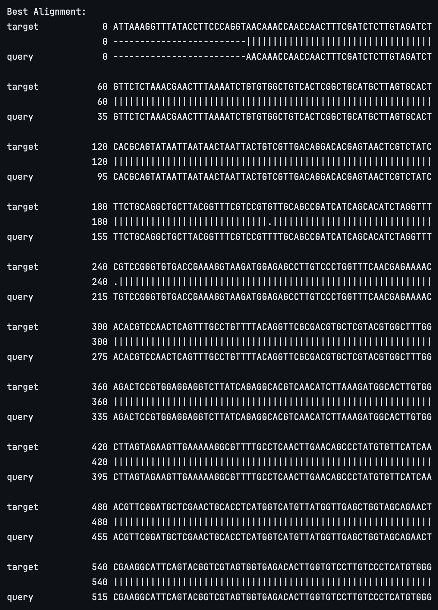

# Identifying Key Mutations for SARS-CoV-2 

## Introduction
The COVID-19 pandemic, caused by the SARS-CoV-2 virus, has led to an unprecedented global health crisis. 
One of the key factors influencing the virus's spread, severity, and vaccine efficacy was its ability to 
quickly mutate over time. Understanding these mutations is crucial for tracking viral evolution and predicting 
potential variants of concern.

This project aims to analyze and characterize mutations in the SARS-CoV-2 genome.
By leveraging genomic data from publicly available databases, I will identify key mutations by
providing insights into the evolutionary dynamics of COVID-19.

## Walk-Through
Navigate to the correct folder and clone the repo.
> cd Development/

Clone the repo
> git clone https://github.com/albertjseo/covid19-mutations.git

Create a directory if needed
> mkdir directoryname

Create a file
> touch filename

Next, navigate to the preferred IDE. I used PyCharm to clean and analyze the data. 

For my analysis I used the NC_045512.2-GenBank sequence as my reference and MZ571142.1 was chosen due to its severity as a
variant.

To ensure a full analysis I do the following:
> <li>Load the reference sequence and mutant sequence</li>
> <li>Align the sequences using PairwiseAligner</li>
> <li>Detect mutations</li>
> <li>Map mutations to protein sequences for insight into functional impact</li>
> <li>Visualizations</li>

## Results
### Alignments

### 

